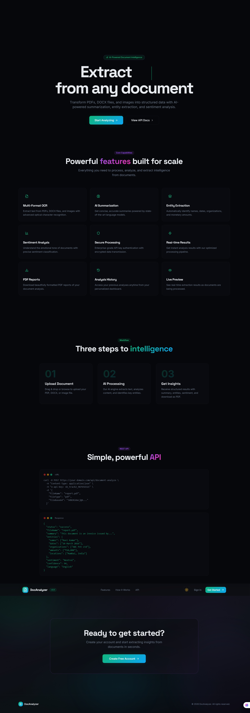
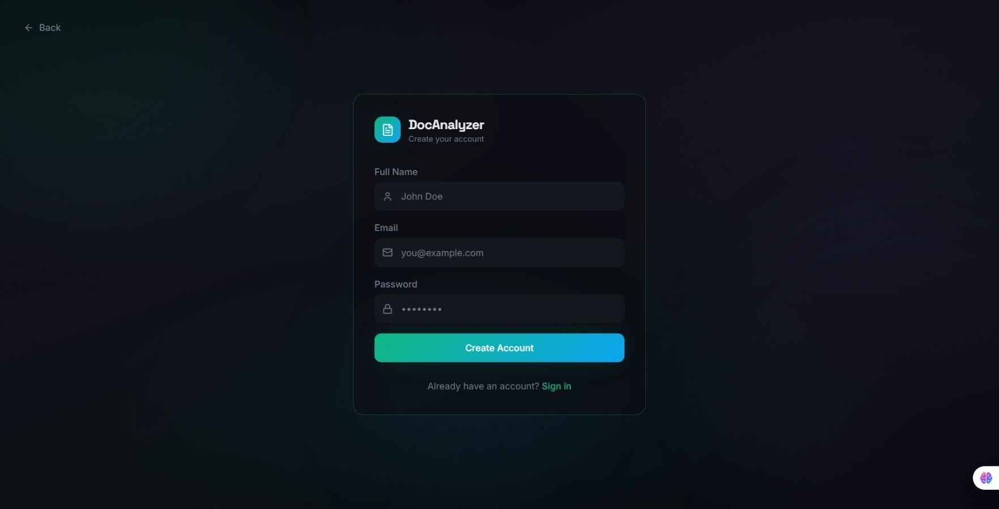
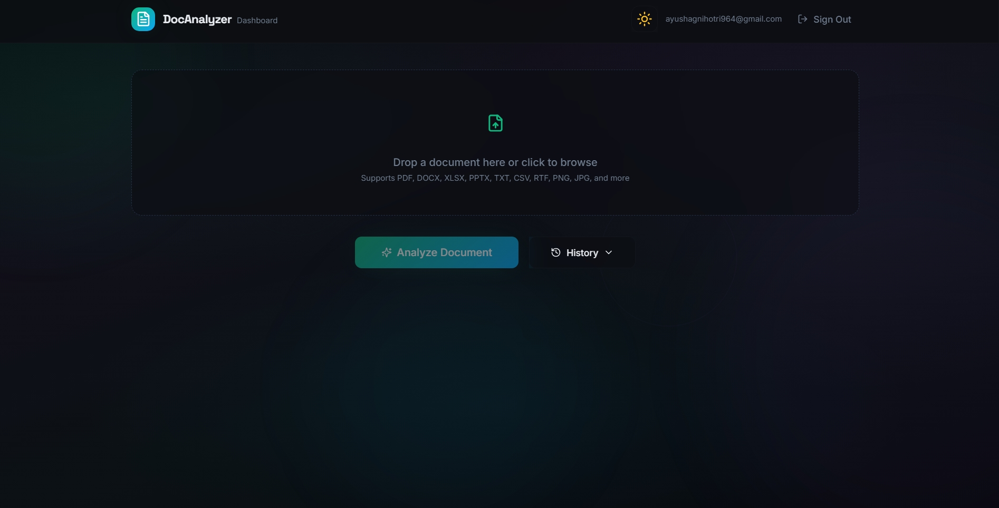

# 🚀 DocAnalyzer AI

  

---

  
  
  

---

## 🌐 Live Demo
🔗 doc-analyzer-flax.vercel.app

---

## 🎬 Demo Preview

  
  

---

## ✨ Overview

**DocAnalyzer AI** is a powerful AI-driven platform that analyzes documents, extracts key insights, and automates workflows with speed and precision.

---

## 🎯 Features

- 🤖 OpenAI-powered document analysis  
- 📄 Smart data extraction  
- ⚡ Real-time processing  
- 📊 Dashboard with history  
- 📥 Export results  
- 🔐 Secure API handling  
- 🎨 Modern animated UI  

---

## 📸 App Flow

### 📤 Upload Document

 

### 📊 Dashboard

     

---

## ⚙️ Tech Stack

- Frontend: React + TypeScript + TailwindCSS  
- Backend: Node.js  
- AI Engine: OpenAI API  
- Deployment: Vercel  

---
